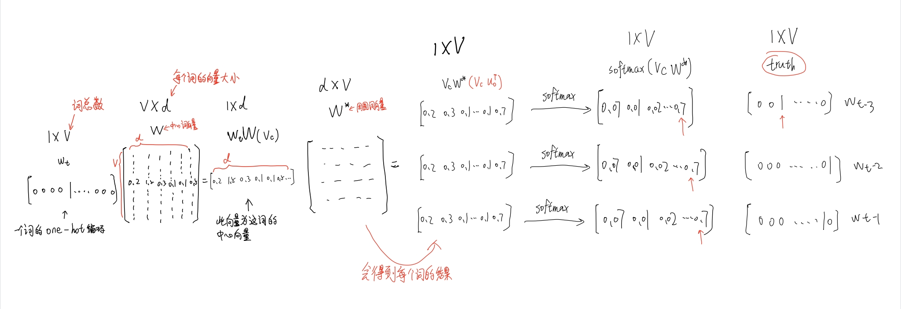
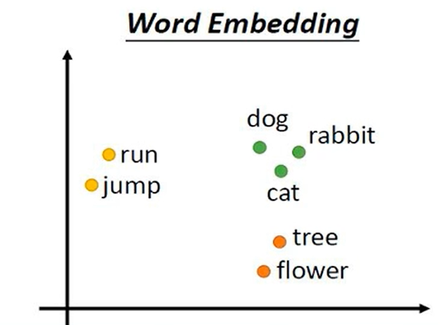

# word2vec模型
word2vec的整体思想是句子中相近的词之间是有联系的
## 一、基础技术
### 1、skip-gram的原理
skip-gram是利用中心词预测周围window内的词（baseline使用python完成，在上方文件中）  
内部是通过矩阵计算实现的，具体实现如下图  
  
skip-gram 原理图详细步骤：
* 首先将中心词转换成一个1\*V的one-hot矩阵
* 设置W和W’这两个矩阵作为中心词矩阵和周围词矩阵，再对两个矩阵随机初始化
* 将中心词one-hot矩阵和W作矩阵相乘得到中心词的词向量，是一个1\*d的矩阵
* 将中心词的词向量与W’作矩阵相乘得到周围词的词向量
* 再对周围词的词向量作softmax归一化处理，得到每个词的概率
* 接下来就是反向传播来调整W和W’这两个矩阵数据进行优化
### 2、CBOW的原理
CBOW是利用周围词预测中心词  
## 二、改进
主要是在输出层上改进
### 1、Hierarchical softmax（层次softmax）
通过其将维度V变为log2V，采用哈夫曼树的思想将softmax转换成计算log2V个sigmoid
### 2、Negative Sampling（负采样）
得到一个正样本概率和几个负样本概率，共K+1个样本，效果比多分类好
## 三、优化
### 1、subsampling of frequent words（重采样）
通过将词频大的，被删除的概率大，词频小的，被删除的概率小，原因是出现次数多的词往往含有的信息少，例如："a"、"the"
## 四、模型复杂度
模型复杂度是通过模型训练时所使用的参数个数来评估的，通过计算得到各模型复杂度  
NNLM：Q=N\*D+N\*D\*H+H\*log2V  
RNNLM：Q=H\*H+H\*log2V  
CBOW+HS：Q=N\*D+D\*log2V  
skip-gram+HS：Q=C(D+D\*log2V)  
CBOW+NEG：Q=N\*D+D\*(K+1)  
skip-gram+NEG：Q=C(D+D\*(K+1))  
## 五、超参数
1. 利用genism做word2vec时，其中dim表示每个词的维度，dim一般选择100-500之间，min_count一般选择2-10之间，如果数据集少则将min_count调为1
2. epochs表示迭代次数，需要根据特定的情况来设置大小
3. window表示窗口大小，通常大小设置为2，也可以根据需求来设置
## 六、word2vec相关知识
### 1、one-hot和分布式表示
1. one-hot编码是将一个词转换成[0 0 0 0 0 1 0....]
2. 分布式表示是将一个词转换成[0.5 0.3 0 0.12 0.7 0.69...]，分布式相比one-hot更能表示词间关系，并且使用了一个1\*d（d为上文所提到的dim）的向量来表示一个词
### 2、word-embedding(词向量)—分布式表示
可以进行词的向量空间的映射，可以表示词的（上下文）含义  

### 3、马尔科夫假设
下一个词的出现仅依赖于前面的一个词或几个词
### 4、语言模型
语言模型的基本思想：句子中下一个词的出现和前面的词是有关系的，所以可以用前面的词预测下一个词
1. NNLM（前向神经网络语言模型）  
NNLM利用了马尔科夫假设，模型是针对每t-1个词的输入来预测下一个词，也即是第t个词是什么，因此模型的实际输出是一个向量1\*V，该向量的每一个分量依次对应下一个词为词典中某个词的概率。所以V维的概率值中必定有一个最大的概率，而其他的概率较小
2. RNNLM（循环神经网络语言模型）  
和NNLM的不同点是：RNNLM是通过前面训练所生成的是s(t-1)和当前训练词的s(t)进行计算，也就是说当前词会受到之前所有词的影响
3. 语言模型的评估指标：困惑度（perplexity）  
句子概率越大，语言模型越好，困惑度越小
4. 语言模型困惑度和Loss的关系  
`pp(s)=exp(L)`
### 5、log-linear model (log线性模型)
将语言模型看成一个多分类问题，相当于线性分类器加上softmax  
`y=softmax(wx+b)`
### 6、Glove 模型
Word2vec和glove都是可以将词编成向量  
两者最直观的区别在于：word2vec是一种基于预测的模型，GloVe是一种基于统计的模型  
从算法实现的角度来说，它们区别在于loss的计算是不同的
## 七、word2vec总结
word2vec主要是利用词向量来表示每个词之间的关系，也许有些词在人的眼里发现不出什么相似之处，但是通过电脑计算却能发现，例如：A与B有关系，B与C有关系，那A和C有关系吗？
所以为了表示词间关系，并且不能像one-hot编码那样词与词是独立的，就需要使用这个模型

